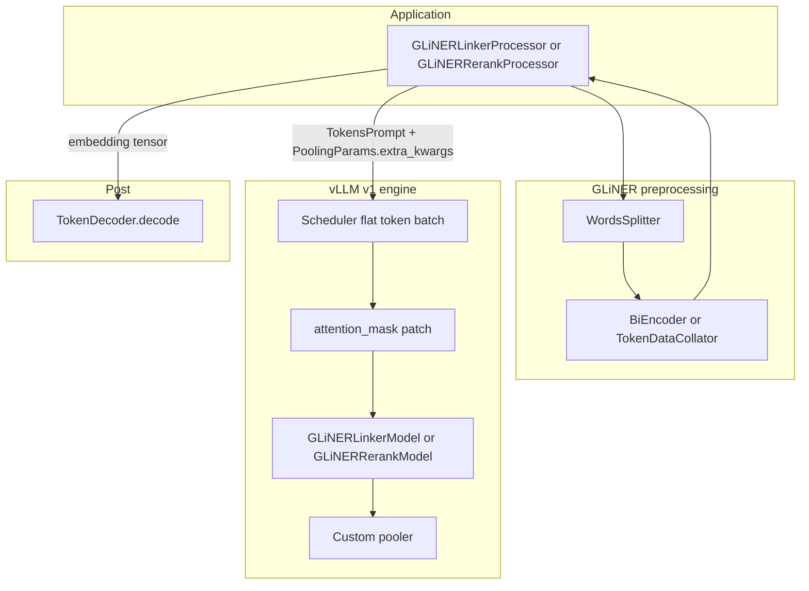

# GLiNER vLLM plugins — engineer handover

> **Status: production-ready.** All GLiNER plugins pass end-to-end parity validation (recall-gated) in bfloat16.  
> The Knowledgator **L3 linker** (`deberta_gliner_linker`) and **L4 rerank** (`modernbert_gliner_rerank`) plugins are under active integration. Parity tests still show **residual drift** (L3: score tolerances; L4: GPU engine instability vs vanilla GLiNER). **Do not rely on them for production** until parity and vLLM/ModernBERT paths are tightened. See [`L3_STATUS.md`](L3_STATUS.md) and [`L4_PARITY.md`](L4_PARITY.md).

This document is the **operational and technical handover** for the two checkpoints above. It explains **what the code does, which parts are hacks, and why they exist**, plus **usage patterns** and **verification**.

A shorter overview with the same model table lives in [`OVERVIEW.md`](OVERVIEW.md).

---

## 1. What you are integrating

| Stage | HF model | Plugin entry point (`pyproject.toml` → `vllm.general_plugins`) | GLiNER architecture |
|-------|----------|--------------------------------|-------------------|
| **L3** | [`knowledgator/gliner-linker-large-v1.0`](https://huggingface.co/knowledgator/gliner-linker-large-v1.0) | `deberta_gliner_linker` | `BiEncoderTokenModel` — text DeBERTa + label side (encoder or precomputed embeds) |
| **L4** | [`knowledgator/gliner-linker-rerank-v1.0`](https://huggingface.co/knowledgator/gliner-linker-rerank-v1.0) | `modernbert_gliner_rerank` | `UniEncoderTokenModel` — one sequence (prompt + words), ModernBERT (ettin) + projection + **LSTM** + scorer |

Both models are **not** generative LLMs. Inference is **`LLM.embed(...)`** (or OpenAI-compatible pooling APIs): the custom **`nn.Module`** runs inside vLLM’s pooling runner; outputs are **embedding vectors** that the Python **processors** reshape and pass to GLiNER’s **`TokenDecoder`** to produce entities.

**Dependencies:** `gliner` on the path for preprocessing/decoding (`pip install "vllm-factory[glinker]"`). **GPU** for real engines; CI mostly validates imports and CPU-side cache prep.

---

## 2. End-to-end data flow (mental model)



1. **Warmup:** load `GLiNER.from_pretrained` enough to get tokenizer, `data_processor`, collator, decoder (L3 also runs **`encode_labels`**).
2. **Per request:** collator builds `input_ids`, `attention_mask`, `words_mask`, `text_lengths` (+ L3: `labels_embeds`).
3. **vLLM:** `embed` schedules tokens; **patch** rebuilds a flat `attention_mask` aligned to scheduled slices; model forward returns hidden states; **pooler** produces a flat score blob.
4. **Decode:** processor reshapes blob to `(1, W, C, 3)` and calls **`TokenDecoder.decode`** with the same `threshold` / `flat_ner` / `multi_label` as vanilla GLiNER.

---

## 3. Shared hack: pooling `attention_mask` monkey-patch

### Problem

vLLM v1’s **`GPUModelRunner._preprocess`** does **not** forward arbitrary **`PoolingParams.extra_kwargs`** into **`model.forward`** — only a small whitelist (e.g. compressed token type ids). GLiNER’s collator **`attention_mask`** must reach the model so:

- **L3:** padded / filler tokens do not attend (DeBERTa text encoder).
- **L4:** **`extract_prompt_features`**-style utilities in the pooler use the mask to separate prompt vs word regions (ModernBERT stack may not apply the mask identically to DeBERTa, but the **pooler** still needs the correct mask for GLiNER parity).

vLLM may also pad prompts with **`vocab_size`** placeholder tokens for scheduling; the **full** mask from the collator must align with **`num_prompt_tokens`** per request.

### Solution

[`plugins/deberta_gliner_linker/vllm_pooling_attention_mask.py`](../plugins/deberta_gliner_linker/vllm_pooling_attention_mask.py) **monkey-patches** `GPUModelRunner._preprocess` **once** (idempotent guard `_gliner_linker_preprocess_patched` on the class).

**Algorithm (`_build_flat_attention_mask`):**

1. For each request `i` in **scheduler order**, read `num_scheduled_tokens` for this step (`L`), `num_prompt_tokens[i]`, `num_computed_tokens_cpu[i]` (chunked prefill).
2. Take `extra_kwargs["attention_mask"]` (full length `npt`), slice **`[computed : computed + L]`**, push onto a list.
3. **`torch.cat`** pieces → flat `(total_scheduled_tokens,)`, then trim or **zero-pad** to `num_input_tokens` (vLLM’s buffer width).

**Failure modes:** if any request omits `attention_mask`, patch returns `None` and the model gets default behavior (often wrong for GLiNER). Length mismatch → **`ValueError`** with an explicit message.

### Who calls it

**Both** plugins call **`apply_pooling_attention_mask_patch()`** inside **`register()`** before vLLM builds the engine. Import order: ensure the plugin is loaded (or set **`VLLM_PLUGINS`**) **before** constructing **`LLM`**.

### Extra verification (L3)

[`scripts/gliner/l3/attention_mask_concat_test.py`](../../scripts/gliner/l3/attention_mask_concat_test.py) exercises flat-mask construction logic.

---

## 4. L3 — `deberta_gliner_linker`

### 4.1 HF snapshot vs vLLM: model directory hacks

The HF repo ships **`gliner_config.json`** but **no** root **`config.json`**. vLLM expects a standard layout.

[`plugins/deberta_gliner_linker/__init__.py`](../plugins/deberta_gliner_linker/__init__.py):

- Writes a fixed **`VLLM_CONFIG`** JSON (DeBERTa encoder hyperparameters, `model_type: gliner_linker`, `architectures: [GLiNERLinkerModel]`).
- Writes **`tokenizer_config.json`** replacing **`tokenizer_class: TokenizersBackend`** with **`PreTrainedTokenizerFast`** so **`AutoTokenizer`** works.
- **Symlinks** weights (`pytorch_model.bin`), tokenizer files, `gliner_config.json` from the HF cache into **`plugins/deberta_gliner_linker/_model_cache/`**.

**Quirk:** **`prepare_model_dir()`** returns early if `config.json` already exists and weights symlink is present — it does **not** always refresh JSON. If you change `VLLM_CONFIG` in code, delete `_model_cache` or bump logic (contrast **L4**, which rewrites config every run — see below).

**API:**

```python
from plugins.deberta_gliner_linker import get_model_path
# First call downloads HF snapshot if needed and materializes _model_cache
model_dir = get_model_path()
```

### 4.2 Model / pooler behavior (parity-critical)

- **Custom** [`GLiNERLinkerModel`](../plugins/deberta_gliner_linker/model.py): Flash DeBERTa–style **text** encoder; pooler can run a **label** encoder or consume **precomputed** `labels_embeds`.
- **Checkpoint may contain `rnn.lstm` weights**; **vanilla GLiNER `BiEncoderTokenModel.forward` does not run LSTM** before the scorer on this path — the pooler **must not** either (this was a past bug; fixed).
- **Spans:** `TokenDecoder` uses **inclusive** end **word** index; char spans use **`word_ends[span.end]`** with **exclusive** string end — must match GLiNER.

### 4.3 Processor: `encode_labels` and tokenizer max length

[`GLiNERLinkerProcessor`](../plugins/deberta_gliner_linker/processor.py) mirrors **GLinker `L3Component._setup`**:

- HF tokenizer often reports a **huge** `model_max_length`; GLinker caps it to **`L3Config.max_length`** (e.g. **512**).
- Without capping, **`encode_labels`** uses `padding="max_length"` but **does not actually pad** → label embedding layout **diverges** from GLinker → **~0.3 score gaps** vs native in `entity_parity_test`.
- **Batch** `encode_labels` with **`batch_size=32`** like GLinker, not only `batch_size=1`.

### 4.4 `PoolingParams.extra_kwargs` (L3)

| Key | Purpose |
|-----|--------|
| `input_ids` | Aligns with `prompt_token_ids` / hidden length checks |
| `attention_mask` | Full-sequence mask; **patched** into `forward` |
| `words_mask` | Word id per subword (1-indexed convention from collator) |
| `text_lengths` | Word count (scalar per request) |
| `labels_embeds` | Precomputed `(C, H)` from `encode_labels` |

### 4.5 L3 verification matrix

| Script / test | What it proves |
|---------------|----------------|
| [`parity_test.py`](../../scripts/gliner/l3/parity_test.py) | HF vs vLLM **logits** (text-only recipe, cos_sim ≈ 1) |
| [`preprocess_parity_test.py`](../../scripts/gliner/l3/preprocess_parity_test.py) | Collator vs `_tokenize` tensors |
| [`entity_parity_test.py`](../../scripts/gliner/l3/entity_parity_test.py) | End-to-end entities vs GLinker native (`GLINKER_ENTITY_SCORE_ATOL`, default **0.05**) |
| [`attention_mask_concat_test.py`](../../scripts/gliner/l3/attention_mask_concat_test.py) | Flat mask concatenation / slicing |

**Pitfall:** **`threshold=0.0`** inside decode makes **`sigmoid > 0`** always true → wrong span search — use a real threshold (e.g. **0.3–0.5**).

Further notes: [`L3_STATUS.md`](L3_STATUS.md).

---

## 5. L4 — `modernbert_gliner_rerank`

### 5.1 HF snapshot vs vLLM: config / RoPE hacks

Same pattern: materialize **`_model_cache/`** with **`config.json`** + symlinks. **Additional complexity:** checkpoint uses **ModernBERT / ettin** with **nested** **`rope_parameters`** (full + sliding attention).

**vLLM + Transformers v4 `patch_rope_parameters`** does effectively:

```python
config.rope_parameters["rope_theta"] = rope_theta
```

If `rope_parameters` is **nested** (keys like `full_attention`, `sliding_attention`), that **injects an invalid sibling key**, breaks **`is_rope_parameters_nested`**, and you get errors like **missing `rope_type`**.

**Mitigations** (both needed in practice):

1. **[`GLiNERRerankConfig.__getattribute__`](../plugins/modernbert_gliner_rerank/config.py):** for **`rope_theta`**, if `rope_parameters` is nested-only, return **`None`** so patch logic does not corrupt the dict.
2. **`_sanitize_vllm_rope_config_dict`** in [`__init__.py`](../plugins/modernbert_gliner_rerank/__init__.py): when serializing `config.json`, **drop** redundant **top-level** RoPE keys (`rope_theta`, `partial_rotary_factor`, …) that duplicate nested config.

**Quirk:** **`prepare_model_dir()`** **always rewrites** `config.json` (no early return), so config fixes apply after pulls; linker cache is more “sticky”.

**vLLM 0.15.x:** [`ModernBertModel`](../plugins/modernbert_gliner_rerank/model.py) must be constructed with **keyword-only** **`vllm_config=`** (upstream API change).

### 5.2 Architecture

- vLLM **`ModernBertModel`** loads **`token_rep_layer.bert_layer.model.*`** weights.
- **Linear projection** `512 → 768`, **bidirectional LSTM** on word embeddings, **Scorer** MLP — matches uni-encoder rerank head.
- **No** separate label encoder: label prompts are **in the same sequence**; pooler uses **`extract_prompt_features`** from hidden states.

### 5.3 Preprocessing differences from L3

- **`TokenDataCollator`** + **`UniEncoderTokenProcessor`**, **`entity_types=labels`**.
- **Warmup does not call `encode_labels`** — no `labels_embeds` in `extra_kwargs`.

### 5.4 Batching semantics (important for support)

**`batch_predict_entities(texts)`** does **not** build one padded `[B, T]` tensor.

- It runs **`_tokenize` per string** (variable `T_i`).
- **`_run_vllm`** passes **`N` `TokensPrompt`s** and **`N` `PoolingParams`** in **one** `embed()` call.
- vLLM may schedule multiple requests in one step; the **attention_mask patch** builds a **flat** mask **concatenating** per-request slices — see §3.

**CPU proof:** [`preprocess_parity_test.py`](../../scripts/gliner/l4/preprocess_parity_test.py) (single + multi-row collator vs per-text `_tokenize`), [`tests/test_modernbert_gliner_rerank_batch_contract.py`](../tests/test_modernbert_gliner_rerank_batch_contract.py).

**GPU proof (when engine works):** [`batch_vllm_parity_test.py`](../../scripts/gliner/l4/batch_vllm_parity_test.py) — sequential `predict_entities` vs one `batch_predict_entities`; child uses **`sys.exit`** so failures are not masked by multiprocessing.

### 5.5 L4 engine status (known pain)

On **vLLM 0.15.1** + CUDA, **end-to-end GPU parity** with vanilla GLiNER is **not** proven in-repo: **Triton** encoder attention (**illegal memory access**), **FlashAttention** / **FlexAttention** shape mismatches for this backbone have been observed. **Preprocessing parity passes**; entity parity Phase 2 may crash.

Details and backend matrix: [`L4_PARITY.md`](L4_PARITY.md).

**Processor knobs for experiments:** `GLiNERRerankProcessor(..., dtype=..., attention_backend=...)` forwarded to **`LLM()`**.

### 5.6 Multiprocessing + CUDA

Same rule as L3 entity test: **do not** call **`torch.cuda.*` in the parent** before **`LLM()`** if the parent has forked children — use **`multiprocessing.get_context("spawn")`** and isolate GPU phases in a **fresh child** (see [`entity_parity_test.py`](../../scripts/gliner/l4/entity_parity_test.py)).

### 5.7 L4 verification matrix

| Script / test | What it proves |
|---------------|----------------|
| `pytest tests/test_modernbert_gliner_rerank_prepare.py` | Model dir / config materialization |
| [`preprocess_parity_test.py`](../../scripts/gliner/l4/preprocess_parity_test.py) | Collator vs `_tokenize` (single + padded multi-row) |
| [`tests/test_modernbert_gliner_rerank_batch_contract.py`](../tests/test_modernbert_gliner_rerank_batch_contract.py) | Variable lengths + mask alignment |
| [`entity_parity_test.py`](../../scripts/gliner/l4/entity_parity_test.py) | Native GLiNER vs vLLM entities (**GPU**, often blocked) |
| [`batch_vllm_parity_test.py`](../../scripts/gliner/l4/batch_vllm_parity_test.py) | Batched vs sequential embed (**GPU**) |

---

## 6. Plugin registration and discovery

[`pyproject.toml`](../pyproject.toml) entry points:

```toml
[project.entry-points."vllm.general_plugins"]
deberta_gliner_linker = "plugins.deberta_gliner_linker:register"
modernbert_gliner_rerank = "plugins.modernbert_gliner_rerank:register"
```

Each **`register()`** calls **`forge.registration.register_plugin(...)`** and **`apply_pooling_attention_mask_patch()`**.

**Environment:**

```bash
export VLLM_PLUGINS=deberta_gliner_linker,modernbert_gliner_rerank
```

Useful when you want to avoid loading unrelated plugins. **`pip install -e .`** from repo root so entry points resolve.

**Validation:** [`forge/validate_plugins.py`](../forge/validate_plugins.py).

---

## 7. Usage patterns

### 7.1 Python processors (recommended for app integration)

**L3:**

```python
from plugins.deberta_gliner_linker.processor import GLiNERLinkerProcessor

proc = GLiNERLinkerProcessor()
proc.warmup(labels)  # list of label strings (same format as GLiNER entity_types)
entities = proc.predict_entities(text, threshold=0.5, flat_ner=True, multi_label=False)
batch = proc.batch_predict_entities([text_a, text_b], threshold=0.5)
proc.close()
```

**L4:**

```python
from plugins.modernbert_gliner_rerank.processor import GLiNERRerankProcessor

proc = GLiNERRerankProcessor()
proc.warmup(labels)
entities = proc.predict_entities(text, threshold=0.5)
batch = proc.batch_predict_entities([text_a, text_b], threshold=0.5)
proc.close()
```

**KB-style labels:** build strings like `"{label}: {description}"` to match GLinker templates (see `entity_parity_test.py` fixtures).

### 7.2 `vllm serve` (pooling runner)

```bash
export VLLM_PLUGINS=deberta_gliner_linker
vllm serve "$(python -c 'from plugins.deberta_gliner_linker import get_model_path; print(get_model_path())')" \
  --trust-remote-code --runner pooling
```

Flags vary slightly by vLLM version; **`--runner pooling`** (or auto-resolve to pooling) is required. You must pass **`PoolingParams.extra_kwargs`** from a client that mirrors the collator — the **processors** above are the reference implementation.

### 7.3 Score tolerance env vars

- L3 entity parity: **`GLINKER_ENTITY_SCORE_ATOL`** (default **0.05** in linker `entity_parity_test.py`).
- L4 entity parity: often **0.08** in its `entity_parity_test.py`; batch test uses the same env var.

---

## 8. Handover checklist for the next engineer

1. Read **§3** (attention mask patch) — every GLiNER pooling bug eventually touches this.
2. Run **L3** `scripts/gliner/l3/preprocess_parity_test.py` and skim **`L3_STATUS.md`**.
3. Run **L4** `pytest tests/test_modernbert_gliner_rerank_prepare.py` and **`scripts/gliner/l4/preprocess_parity_test.py`**.
4. If you have GPU: run **L3** `entity_parity_test.py`; run **L4** `batch_vllm_parity_test.py` and (if stable) `entity_parity_test.py`.
5. Before changing **`prepare_model_dir`**: note **L3 early return** vs **L4 always rewrite**.
6. Before upgrading **vLLM**: re-run parity scripts; watch **ModernBERT attention** backends and **`GPUModelRunner._preprocess`** signature.

---

## 9. Related documentation (file map)

| Document | Content |
|----------|---------|
| [`OVERVIEW.md`](OVERVIEW.md) | Short overview + quick links |
| This guide | Deep handover |
| [`L3_STATUS.md`](L3_STATUS.md) | L3 parity / label-encoding notes |
| [`L4_NOTES.md`](L4_NOTES.md) | Pointer that L4 is not DeBERTa |
| [`L4_PARITY.md`](L4_PARITY.md) | L4 preprocess vs GPU status |

---

## 10. Summary table: quirks at a glance

| Topic | L3 linker | L4 rerank |
|-------|-----------|-----------|
| Missing `config.json` | Generated + tokenizer class fix | Generated from `gliner_config.json` + RoPE sanitize |
| Cache refresh | Sticky if `_model_cache` exists | Rewrites `config.json` each `prepare_model_dir` |
| Attention mask patch | Required | Required (pooler + scheduling) |
| Label embeddings | `encode_labels` + tokenizer max cap | None (uni-encoder) |
| LSTM in checkpoint | Not used in GLiNER forward | **Used** in inference path |
| GPU parity | Proven (with tolerances) | Preprocess proven; full GPU often broken on vLLM 0.15.x |
| Batched inputs | N requests, flat mask concat | Same |

If something breaks after a vLLM upgrade, start with **`vllm_pooling_attention_mask.py`**, then **scheduler / `num_prompt_tokens`** alignment, then **RoPE** (L4) or **`encode_labels`** (L3).
